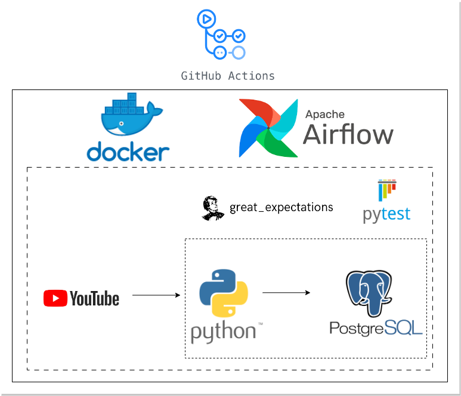
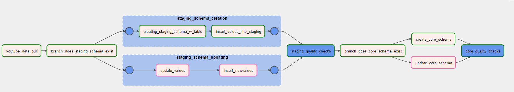
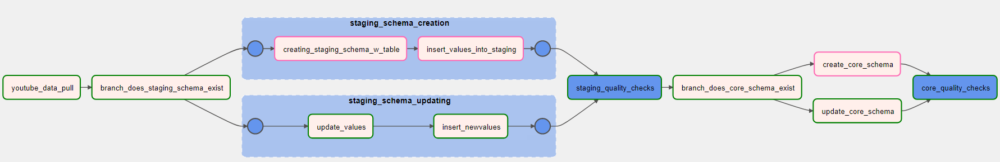
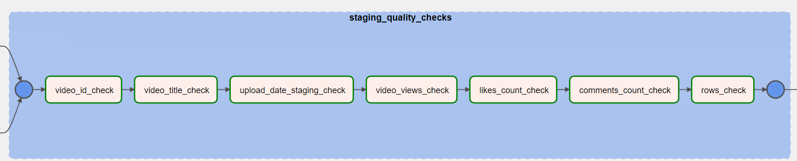
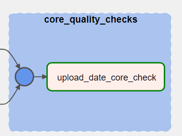
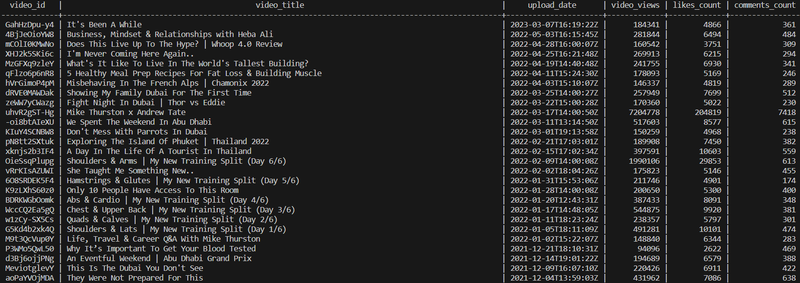
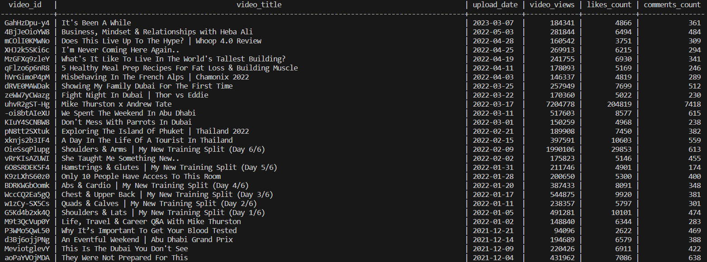
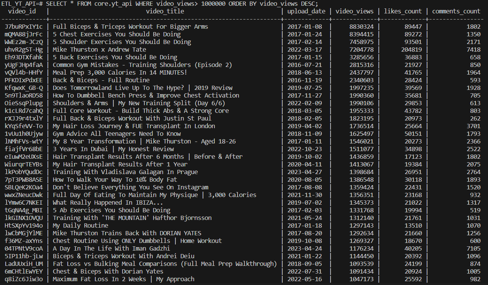

# **Youtube API - ETL**

## **Architecture** 

<p align="center">
  
</p>

## **Motivation** 

The aim of this project is to get familiar with data engineering tools such as Python, Docker & Airflow to produce an ETL data pipeline. To make the pipeline more robust, best practices of; unit & data quality testing and continuous integration (CI) are also implemented.

## **Dataset** 

As a data source, the Youtube API is used. This API is used instead of, for example, Spotify or Twitter API as I had seen that these two in particular have been used repeatedly for similar projects. 
The data of this project is pulled from the channel 'Mike Thurston' which is a popular fitness Youtube channel.

It is good to note that this project can be replicated for any other Youtube channel as long as you have the Youtube Channel ID for the channel in question. 

## **Summary**

This ETL project uses Airflow as an orchestration tool, packaged inside docker containers. The steps that make up the project is as follows:

1. Data is **extracted** using the Youtube API with Python scripts 
2. The data is initially loaded into a `staging schema` which is a dockerized PostgreSQL database
3. From there, a python script is used for minor data **transformations**. 
4. Once transformations are completed the data is **loaded** into the `core schema` (also a dockerized PostgreSQL database) 

The first (initial) API pull loads the data - This is the Staging/ Core schemas **_creation_** DAG run scenario. 

Successive pulls update the values for certain variables (columns) - This is the Staging/ Core schemas **_updating_** DAG run scenario. 

Once the core schema is populated and both unit and data quality tests have been implemented, the data is then ready for analysis. Querying of the data is performed by first accessing the postgres docker container and then using SQL logic.

The following six variables are extracted from the API: 
* *Video ID*, 
* *Video Title*, 
* *Upload Date*, 
* *Video Views*,
* *Likes Count*, 
* *Comments Count*

## **Tools & Technologies**

* *Containerization* - **Docker**, **Docker-Compose**
* *Orchestration* - **Airflow**
* *Data Storage* - **Postgres**
* *Languages* - **Python, SQL**
* *Testing* - **Great Expectations**, **pytest**
* *CI* - **Github Actions**

## **Containerization**

To deploy Airflow on Docker, the official [docker-compose.yaml](https://airflow.apache.org/docs/apache-airflow/2.6.2/docker-compose.yaml) file is used with some changes:

1. The image used is an extended image, built using a Dockerfile. This image is pulled/pushed from/to to Docker Hub using the Github Actions CI workflow yaml file. Once the image is created, the docker-compose yaml file can be executed to run the multiple containers - This is also done in the CI workflow.

2. Database Connection and Variables are specified as environment variables. 

The Connection is given in a URI format and has the following naming convention: `AIRFLOW_CONN_{CONN_ID}` 

while the Variables are specified as such: `AIRFLOW_VAR_{VARIABLE_NAME}`

3. A Fernet key is used to encrypt passwords in the connection and variable configuration.

## **Orchestration**

The DAG can be visualized using the Airflow UI through http://localhost:8080. The DAG can be broken down as follows:

* Youtube data pull
* Branching into either Staging Schema Creation or Updating
* Staging schema data quality checks
* Branching into either Core Schema Creation or Updating
* Core schema data quality checks

### **Staging/ Core schemas _creation_ DAG run scenario**

<p align="center">
  
</p>

### **Staging/ Core schemas _updating_ DAG run scenario**

<p align="center">
  
</p>

One could argue that the DAG design need not have the branching components since the staging/core schemas creation is a one time event and successive pulls will always branch along the updating route. Although this is true, the design was chosen to get accustomed with using the `@task.branch` (BranchPythonOperator) in Airflow and also to use trigger rules such as `none_failed_min_one_success`.

## **Testing**

Both unit and data quality testing are implemented in this project. Note that data quality tests are performed on each column 

### **Unit tests**

* No DAG import errors,
* DAG exists,
* Number of tasks in DAG is correct
* DAG starts at the correct date and runs once a day at midnight
* DAG tasks are ordered correctly
* DAG triggering on the correct rules
* Airflow Variables & Connections exist
* _TOKENS_ list (in python script) has the correct properties to loop through the YT API data
* API URL gives status 200 code

### **Data quality tests** 

**Staging**

<p align="center">
  
</p>

* **video_id_check**
  1. Not Null 
  2. Unique
  3. Type Object
  4. Length of each id == 11
* **video_title_check**
  1. Not Null
  2. Type Object
* **upload_date_staging_check**
  1. Not Null
  2. Type Object
* **video_views_check**
  1. Not Null
  2. Type Integer
  3. Value greater than both Likes and Comments
* **likes_count_check**
  1. Not Null
  2. Type Integer
* **comments_count_check**
  1. Not Null
  2. Type Integer
* **rows_check**
  1. Number of rows == Number of Videos

**Core**

<p align="center">
  
</p>

* **upload_date_core_check**
  1. No video upload date that predates Youtube Channel joined date

## **Continuous Integration - CI**

The CI part of this project is needed for when you make a change in the code and want to test that the DAG is still working and if the need arises to change some or add unit tests, then this can be carried out in a CI workflow process. These two types of tests are done using the below command: 

```
run: | 
  docker exec -t youtube-etl_airflow-scheduler_1 sh -c "airflow dags test yt_etl"
  docker exec -t youtube-etl_airflow-scheduler_1 sh -c "pytest dags/tests/ -v"
```
Two other points need to be mentioned to explain the CI workflow used: 

* The [image](https://hub.docker.com/repository/docker/mattschembri/yt_etl/general) used by the docker-compose file is pushed to Docker Hub using the action `docker/build-push-action@v4` and is then pulled from Docker Hub to be used by the docker-compose yaml file. 
* [Environment Secrets](https://docs.github.com/en/actions/security-guides/encrypted-secrets), which is a feature of Github Actions, are used to store sensitive parameters used in the workflow. These include; the Airflow Connection and Variables, Fernet Key & Docker Hub credentials.

*Note*: Continuous Deployment (CD) is not introduced in this project but will be included in future projects when cloud deployment tools provided by AWS & Azure are used.

## **Data Storage**

To **locally** access the postgres container that contains the final data, the below docker command is used:

```
docker exec -it youtube_api-postgres-1 bash
```

The staging and core schemas can be observed below after accessing the postgres container. The only difference (**transformation**) between the staging and core schema in this project is that the time of upload is removed from the `upload_date` column.

**Staging Schema**

<p align="center">
  
</p>

**Core Schema**

<p align="center">
  
</p>


Querying can be done using SQL logic. In the below query only the videos that have more than 1 million views are queried and results are sorted descending by `video_views` count:

```sql
SELECT 
  *
FROM 
  core.yt_api 
WHERE 
  video_views> 1000000 
ORDER BY 
  video_views DESC;
```

<p align="center">
  
</p>
